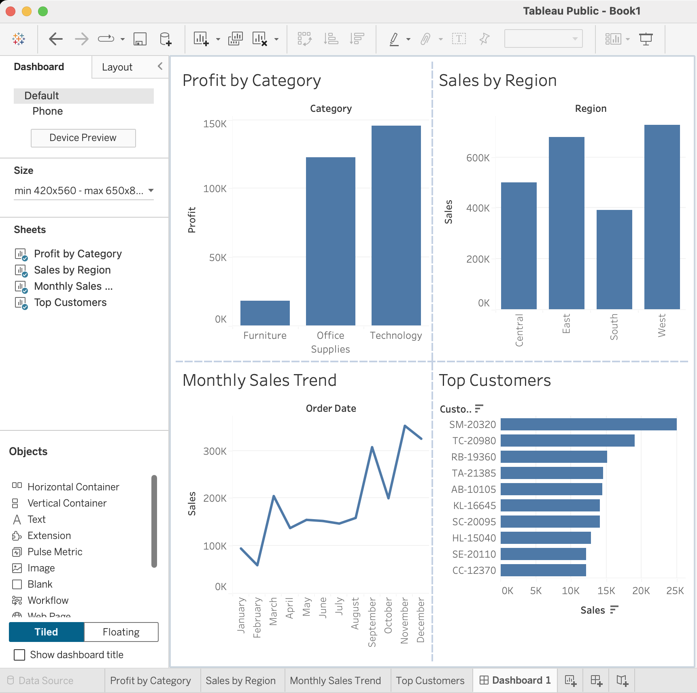

# Retail Sales Performance Analysis

## Project Overview
This project analyzes retail sales data using Python, SQL, 
and Tableau to uncover business insights related to regional performance, 
customer behavior, profitability, and sales trends.

---

## Tools Used
- Python
- pandas
- Matplotlib
- SQLite
- Tableau Public
- Jupyter Notebook

---

## Key Business Insights
- The West region generated the highest sales revenue.
- Technology was the most profitable category.
- Sales trends showed seasonal fluctuations throughout the year.
- A small group of customers contributed significantly to total revenue.

---

## Dashboard Preview



---

## SQL Analysis Examples

```sql
SELECT Region, SUM(Sales) AS total_sales
FROM sales
GROUP BY Region
ORDER BY total_sales DESC;
```

---

## Project Structure

```text
data/
notebooks/
images/
sql/
README.md
```

---

## Skills Demonstrated
- Data Cleaning
- Exploratory Data Analysis (EDA)
- SQL Querying
- Data Visualization
- Dashboard Design
- Business Insight Communication